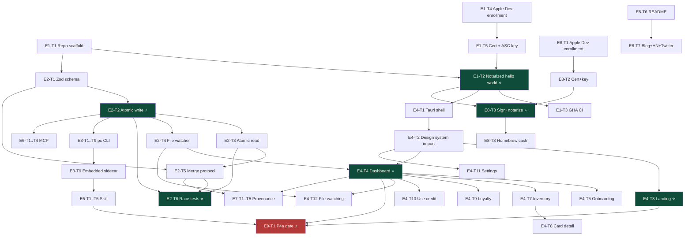

# LifeOps — Workback Plan v0.1

> **Status:** Draft, ready for review · 2026-04-30
> **Owner:** TPM (Anand)
> **Source spec:** [`~/All_Projects/Knowledge/projects/lifeops/2026-04-30-design-v2-revised.md`](../../All_Projects/Knowledge/projects/lifeops/2026-04-30-design-v2-revised.md) (v2.2, locked)
> **Design system:** [`design/DESIGN.md`](design/DESIGN.md) + tokens + components (this repo)
> **Target ship dates:** Sprint 1 by 2026-06-05 · Sprint 2 by 2026-06-19 · Public launch by 2026-07-03

This is the execution plan: how to break the v2.2 spec into epics, tickets, dependencies, and per-ticket gates so a small team (or solo + AI tools) can ship without surprises.

---

## 0. How to read this document

- **Epics** = vertical slices that ship as a unit (E1-E9).
- **Tickets** = atomic units of work (Linear/Jira/GitHub-issue ready). Format: `E{n}-T{m}`.
- Every ticket has: **owner role · effort (h) · deps · acceptance criteria · workflow gates · skill invocations**.
- Workflow gates are **always the same**: Implement → Adversarial Review → QA → Pre-merge Review → Ship.
- Critical path is highlighted in §10. Anything off the critical path can be parallelized.
- Section §13 collapses the team plan into a solo-with-AI execution timeline.

---

## 1. Executive summary

**Scope:** Ship LifeOps.app (native macOS Tauri+Vite+React) + Loyalty Context Skill + reference Personal Context schema as open-source MIT artifacts, under a 5-weekend timeline.

**9 epics, ~52 tickets, ~190 estimated engineer-hours.** With a 3-person team that's ~3 calendar weeks at 50% utilization. Solo with AI tools, ~5 weekends per the spec.

**The whole project is gated by 4 falsifiable validation tests (P4a-P4d).** Project killed if 2 of 4 fail. P4a (prediction test) is the Sprint 1 gate; if you don't hit ≥7/9 specific predictions correct in 3 trip-plan sessions, no Sprint 2.

**Three load-bearing single decisions** (per spec eng+design review):
1. **Notarization plumbing** (E1-T2) — single highest schedule risk. Hello-world `.dmg` signed before any product code.
2. **`packages/context-io`** (E2-T2) — single highest correctness foundation. Atomic IO with property-based race tests.
3. **Landing transcript screen** (E4-T3) — single biggest showcase decision. The launch artifact for HN/Twitter.

If those three are right, the rest is mechanical.

---

## 2. Team assumption

**Hypothetical team (used to compute parallelization):**

| Role | Code | Owns |
|---|---|---|
| Tech Lead / Backend | **TL** | Repo scaffold, signing pipeline, `context-io`, schema, CLI, MCP server |
| Frontend Engineer | **FE** | Tauri shell, all 8 React screens, state management, file-watching |
| Designer-Engineer | **DE** | Design system maintenance, visual polish, design QA |
| Product Lead | **PM** | Spec ownership, schema validation against real data, copy, P4a-P4d acceptance |

**Solo-with-AI variant (Anand alone):**

| AI Role | Tool | Substitutes for |
|---|---|---|
| Primary engineer | Claude Code (Opus 4.7) | TL/FE during implementation |
| Adversarial reviewer | Codex (GPT-5.4) via `/codex:rescue` | Independent code review |
| Visual reviewer | `/gstack-design-review` skill | DE |
| QA harness | `/gstack-qa` + `/gstack-qa-only` | Manual testing |
| PM | Anand | Anand |

Solo timeline matches spec: 5 weekends. Team timeline: ~3 calendar weeks at 50% utilization.

---

## 3. Workflow standard (per ticket)

Every ticket goes through these 5 gates. **No ticket ships without all 5.**

```
┌──────────────────┐
│ 1. IMPLEMENT     │  Engineer writes code per acceptance criteria
└────────┬─────────┘
         ▼
┌──────────────────┐
│ 2. ADVERSARIAL   │  Different model family / engineer independently reviews
│    REVIEW        │  Claude code → Codex review · Codex code → Claude review
└────────┬─────────┘
         ▼
┌──────────────────┐
│ 3. QA            │  Run the thing. Test golden path + edge cases.
│                  │  Visual changes → /gstack-design-review
└────────┬─────────┘
         ▼
┌──────────────────┐
│ 4. PRE-MERGE     │  /gstack-review on the diff against base branch
│    REVIEW        │  Verify no security/SQL/conditional-side-effect issues
└────────┬─────────┘
         ▼
┌──────────────────┐
│ 5. SHIP          │  /gstack-ship → bump VERSION, update CHANGELOG, PR
│                  │  /gstack-land-and-deploy after merge
└──────────────────┘
```

**Why two review gates (steps 2 + 4)?** Adversarial review catches *implementation* issues (bugs, missed edge cases, wrong abstractions). Pre-merge review catches *integration* issues (security, regressions, codebase consistency). Different angles, both needed for load-bearing code.

**Skip rules:**
- Step 2 can be skipped for trivial typo/docs changes.
- Step 3 can be downgraded to `/gstack-qa-only` (report-only, no fix loop) for non-UI changes.
- Step 4 cannot be skipped on any code change.
- Step 5 cannot be skipped — every merge to main goes through `/gstack-ship`.

---

## 4. Skill invocation matrix

The user has these skills installed. This table tells engineers exactly what to invoke at each gate.

| Phase | When | Skill |
|---|---|---|
| Pre-implement (ambiguous spec) | Before coding | `/superpowers:brainstorming` |
| Pre-implement (multi-step) | Before coding non-trivial work | `/superpowers:writing-plans` |
| Implement (load-bearing) | context-io, schema, signing | `/superpowers:test-driven-development` |
| Implement (UI feature) | Any new screen | `/feature-dev:feature-dev` |
| Implement (UI design) | Generate variants | `/gstack-design-shotgun` |
| Adversarial review | After code, before QA | `/codex:rescue` (consult mode) OR `/coderabbit:review` |
| Adversarial review (deep) | Load-bearing modules | `/superpowers:requesting-code-review` (subagent reviewer) |
| QA — find bugs | UI changes | `/gstack-qa` (find + fix loop) |
| QA — report only | Non-fixable bugs report | `/gstack-qa-only` |
| QA — visual polish | UI changes | `/gstack-design-review` |
| Verify before claiming done | Always before "ship" | `/superpowers:verification-before-completion` |
| Pre-merge review | After QA, before merge | `/gstack-review` |
| Ship | Create PR | `/gstack-ship` |
| Land + deploy | After PR merged | `/gstack-land-and-deploy` |
| Post-deploy canary | After deploy | `/gstack-canary` |
| Save context | End of session | `/gstack-context-save` |
| Resume context | Start of session | `/gstack-context-restore` |
| Document release | After ship | `/gstack-document-release` |
| Health check | Weekly | `/gstack-health` |
| Retro | End of sprint | `/gstack-retro` |

---

## 5. Adversarial review assignment

For load-bearing code, both model families review. The default rule:

| Module | Implementer | Reviewer | Why |
|---|---|---|---|
| `packages/context-io` | Claude (TDD) | Codex (`/codex:rescue --challenge`) | Atomic IO + race conditions = needs adversarial mind |
| `packages/schema` (Zod) | Claude | Codex review | Schema correctness propagates |
| Signing/notarization pipeline | Claude | Codex review | One-shot CI infra; can't iterate easily after release |
| `pc` CLI commands | Claude | `/coderabbit:review` (PR diff) | Standard CLI; CodeRabbit is sufficient |
| React screens (chrome) | Claude | `/gstack-design-review` | Visual + structural review |
| React screens (logic) | Claude | `/codex:rescue` (consult) on critical handlers | State management bugs are subtle |
| MCP server | Claude | Codex review | Multi-client interface; misuse risk |
| Provenance/merge UI | Claude + Codex (split) | The other one reviews | Field-level merge correctness is critical |
| Auto-updater | Claude | Codex review | Key custody is security-critical |
| Skill (SKILL.md + bash) | Claude | Codex review | bash injection risk |
| Benefit-pack JSONs | PM (manual) | Claude validate | Data, not code; cross-check against issuer T&Cs |

**Rule:** if a bug in this module would silently corrupt data or leak secrets → both models review. Otherwise one is enough.

---

## 6. Epic overview

| ID | Epic | Owner | Tickets | Effort (h) | Sprint | Critical path? |
|---|---|---|---|---|---|---|
| E1 | Foundation & Pipeline | TL | 6 | 24 | S1.W1 | ⭐ Yes (T2) |
| E2 | Schema & I/O Core | TL | 6 | 28 | S1.W1-W2 | ⭐ Yes |
| E3 | CLI (`pc`) | TL | 8 | 21 | S1.W2-W3 | ⭐ Yes |
| E4 | Native App (Tauri+Vite+React) | FE | 11 | 51 | S1.W2-W3 + S2 | ⭐ Yes |
| E5 | Skill (Claude/ChatGPT) | TL | 5 | 12 | S1.W3 | ⭐ Yes |
| E6 | MCP Server | TL | 4 | 14 | S2 | No |
| E7 | Provenance & Merge | FE+TL | 5 | 14 | S2 | No |
| E8 | Distribution & Launch | TL | 6 | 18 | S2-S3 | Yes (signing) |
| E9 | Validation & Telemetry | PM | 5 | 16 | All sprints | Yes (P4a gate) |
| **Total** | | | **56** | **198** | | |

**v0.2 changes (2026-05-02):** +E3-T10 `pc add` (3h, S1.W3, pulled from S2 E7-T4); +E4-T13 in-app data-entry forms (7h, S1.W3, NEW); E4-T7/T8/T9 (inventory/detail/loyalty screens, 12h total) deferred from S1 to S2 to make room.

---

## 7. Epics — detailed tickets

### EPIC E1 — Foundation & Pipeline

**Goal:** Get a notarized empty `.dmg` shipping through CI before any product code is written. Single highest schedule-risk item per both eng reviews.

| ID | Title | Owner | Hours | Deps | Workflow |
|---|---|---|---|---|---|
| E1-T1 | Repo scaffold (pnpm workspace, .gitignore, LICENSE, README skeleton) | TL | 1 | — | impl→review→ship |
| E1-T2 | **Notarized Hello World pipeline** ⭐ critical path | TL | 8 | E1-T1 | impl→adversarial→QA→review→ship |
| E1-T3 | GitHub Actions CI (`tauri-action@v0`, macos-14 runners, ASC API key in secrets) | TL | 3 | E1-T2 | impl→review→ship |
| E1-T4 | Apple Developer Program enrollment ($99, 1-3 day wait) | PM | 0.5 wall + 24-72h wait | — | — |
| E1-T5 | Code-signing certificate + ASC API key (.p8) into 1Password + GitHub Secrets | TL | 1 | E1-T4 | impl→review→ship |
| E1-T6 | Embedded `pc` sidecar in `.app/Contents/Resources/` (just a stub for E1) | TL | 2 | E1-T2, E3-T1 | impl→review→ship |

**E1-T2 — Notarized Hello World pipeline**
- **Acceptance:** `git tag v0.0.1 && git push --tags` produces a signed + notarized `.dmg` via GitHub Actions. Right-click → Open works. `xattr -dr com.apple.quarantine` not required. `notarytool log` shows success.
- **Adversarial review:** `/codex:rescue` reviews the GHA workflow YAML — common pitfalls (entitlements file missing, `--keychain` path wrong, ASC API key permissions wrong).
- **QA:** Download the `.dmg` from a fresh Mac (or fresh user account), open without warning, verify in `spctl --assess`.
- **Skill invocations:** `/superpowers:writing-plans` first (multi-step infra), `/codex:rescue --consult "review GHA tauri-action workflow for first-release pitfalls"`, then `/gstack-review` on the PR.

**Cuts from spec confirmed:**
- Apple Dev enrollment is **deferred to Sprint 3 launch gate** per UC-deferral, but E1-T2 still needs *some* signing path (Personal Team / free signing) to test the pipeline. Sprint 3 swaps in Developer ID cert.

---

### EPIC E2 — Schema & I/O Core

**Goal:** Bulletproof atomic IO + Zod schema as the load-bearing core.

| ID | Title | Owner | Hours | Deps | Workflow |
|---|---|---|---|---|---|
| E2-T1 | `packages/schema` Zod schemas (benefit_definitions, credit_instances, loyalty, cards, service_credits, _meta) | TL | 5 | E1-T1 | impl→adversarial→review→ship |
| E2-T2 | **`packages/context-io` atomic write** (lock + tmp + fsync + rename + parent fsync) ⭐ | TL | 6 | E2-T1 | TDD impl→adversarial→QA→review→ship |
| E2-T3 | `context-io` atomic read (parse retry, partial-parse rejection) | TL | 3 | E2-T2 | TDD impl→review→ship |
| E2-T4 | `context-io` file-watcher (chokidar, 150ms debounce) | TL | 3 | E2-T2 | impl→review→ship |
| E2-T5 | `context-io` field-level merge protocol (pure function: human > gmail-receipt > gmail-statement > benefit-pack-default) | TL | 5 | E2-T1, E2-T3 | TDD impl→adversarial→review→ship |
| E2-T6 | **Property-based race tests** (`fast-check`, many readers + writers, no partial parse, lost-update detected) ⭐ | TL | 6 | E2-T2, E2-T3, E2-T5 | impl→adversarial→ship |

**E2-T2 — Atomic write (load-bearing)**
- **Acceptance:** Pure function `atomicWrite(path, contents): Promise<void>`. Lock acquired via `proper-lockfile`; write to tmpfile in same dir; fsync tmpfile; rename atomic; fsync parent dir. Throws on lock contention with backoff. Survives mid-write SIGKILL without leaving a half-written YAML.
- **Adversarial review:** `/codex:rescue --challenge "try to break atomicWrite under concurrent writes, partial fsync, ENOSPC, EROFS, NFS"`. Codex tries to break it; you fix.
- **QA:** Property-based test (E2-T6) is the QA. Manual: `kill -9` mid-write 100 times in a loop; YAML always parses cleanly.
- **Skill invocations:** `/superpowers:test-driven-development` (TDD is non-negotiable here). `/codex:rescue --challenge` for the adversarial pass.

**E2-T6 — Race tests**
- **Acceptance:** `fast-check` property: ∀ N readers + M writers running concurrently for T seconds, every reader sees a valid YAML; every successful write is observable by a subsequent read; lost-update is detected (write rejects if the underlying file changed since the read it was based on). Test runs in CI.
- **Adversarial review:** Codex reviews the property statements themselves — does each property actually rule out the bug class it claims to?

---

### EPIC E3 — CLI (`pc`)

**Goal:** Bun-bundled binary, embedded in `LifeOps.app/Contents/Resources/`, also installable globally for power users.

| ID | Title | Owner | Hours | Deps | Workflow |
|---|---|---|---|---|---|
| E3-T1 | `apps/cli` bootstrap (Bun + Commander) | TL | 1 | E1-T1 | impl→ship |
| E3-T2 | `pc init` (writes example yaml at ~/.personal-context.yaml) | TL | 1 | E2-T1, E3-T1 | impl→ship |
| E3-T3 | `pc demo` (writes `examples/demo-fake-yaml.yaml`, sets demo mode) | TL | 1 | E3-T1 | impl→ship |
| E3-T4 | `pc validate` (Zod parse + report errors) | TL | 2 | E2-T1, E3-T1 | impl→review→ship |
| E3-T5 | `pc query` (read context-io, return JSON; supports `--brand=X`, `--expiring=30d`) ⭐ | TL | 4 | E2-T2, E2-T3, E3-T1 | impl→adversarial→QA→review→ship |
| E3-T6 | `pc list` + `pc doctor` (system check, lock status, schema version) | TL | 2 | E3-T5 | impl→review→ship |
| E3-T7 | `pc install-claude` (writes Skill manifest entry into Claude config) | TL | 3 | E5-T1 | impl→QA→review→ship |
| E3-T8 | `bun build --compile` single binary, smoke test on macOS-14 | TL | 2 | E3-T1 to E3-T7 | impl→QA→ship |
| E3-T9 | Embed `pc` binary in `.app/Contents/Resources/` (replaces stub from E1-T6) | TL | 2 | E3-T8, E1-T6 | impl→QA→ship |
| E3-T10 | **`pc add` (pulled from Sprint 2 E7-T4)** — `pc add card --issuer=amex --product=gold ...` writes via context-io ⭐ | TL | 3 | E2-T2, E2-T5, E3-T1 | TDD impl→adversarial→QA→review→ship |

**E3-T10 — `pc add` (brought forward from Sprint 2)**
- **Why moved:** PM decision (2026-05-02) — populate real data via Skill ("Hey Claude, add my Amex Gold") in addition to in-app forms. `pc add` is the CLI primitive the Skill calls.
- **Acceptance:** `pc add card --issuer=amex --product=gold --annual-fee=250 --currency=USD --anchor-date=2024-03-15` writes a valid YAML entry via `context-io` atomic write. If entry exists, applies field-level merge protocol (E2-T5) — does NOT silently overwrite. Zod-validates result before write. Exit codes: 0 ok, 2 schema invalid, 3 lock contention, 4 conflict needs override.
- **Adversarial review:** `/codex:rescue --challenge "edge cases on pc add: duplicate id, malformed cadence, currency mismatch, transfer_partners array push semantics, race with concurrent writes"`.
- **Sprint 2 implication:** E7-T4 is reduced from 4h to 2h — only the *interactive* `pc add` (multi-step prompt walkthrough) + `pc backup/restore/migrate` remain in S2.

**E3-T5 — `pc query` (load-bearing for Skill)**
- **Acceptance:** `pc query --brand=hyatt` returns valid JSON with all hyatt-related entries (loyalty, cards, service_credits) with provenance metadata. `pc query --expiring=30d` returns credit_instances expiring within 30 days, sorted by expires_at. Exit codes meaningful (0 success, 2 schema invalid, 3 file missing, 4 lock contention).
- **Adversarial review:** `/codex:rescue --consult "review pc query for injection risks (--brand=' OR 1=1 type), error handling, exit codes"`.
- **Skill invocations:** `/superpowers:test-driven-development`.

---

### EPIC E4 — Native App (Tauri+Vite+React)

**Goal:** Implement the 8 mockups from `design/` as real Tauri+Vite+React. Consume `design/lifeops-tokens.css` + `design/lifeops-components.css`.

| ID | Title | Owner | Hours | Deps | Workflow |
|---|---|---|---|---|---|
| E4-T1 | Tauri shell + Vite+React+TS+Tailwind v3 + shadcn baseline | FE | 4 | E1-T2 | impl→QA→review→ship |
| E4-T2 | Import design system (`@import design/lifeops-tokens.css` + `lifeops-components.css`); wire shadcn to LifeOps tokens | FE+DE | 3 | E4-T1 | impl→design-review→ship |
| E4-T3 | **Landing screen (UC10)** — side-by-side transcript ⭐ | FE | 6 | E4-T2 | impl→design-review→QA→review→ship |
| E4-T4 | **Dashboard (UC12)** — hero card + chip strip + collapsed inventory ⭐ | FE | 6 | E4-T2, E2-T2, E2-T4 | impl→design-review→QA→review→ship |
| E4-T5 | Onboarding wizard (Welcome → "See it work" → demo dashboard <2s) | FE | 4 | E4-T4, E3-T3 | impl→design-review→QA→review→ship |
| E4-T6 | Pre-warmed splash screen (mask Tauri cold-start) | FE | 2 | E4-T1 | impl→QA→ship |
| E4-T7 | Inventory expanded screen (12-card grid) | FE | 4 | E4-T4 | impl→design-review→QA→ship — **DEFERRED to Sprint 2 (PM decision 2026-05-02)** |
| E4-T8 | Card detail screen (Amex Gold drilldown + side rail) | FE | 4 | E4-T7 | impl→design-review→QA→ship — **DEFERRED to Sprint 2** |
| E4-T9 | Loyalty status screen (Marriott/Hyatt elite cards + minor programs) | FE | 4 | E4-T4 | impl→design-review→QA→ship — **DEFERRED to Sprint 2** |
| E4-T10 | "Use credit" interaction (modal + stepper + slider + tray slide animation + undo toast) | FE | 5 | E4-T4 | impl→design-review→QA→adversarial→review→ship |
| E4-T11 | Settings sheet (Mac HIG: tabs, source, refresh cadence, theme, notifications, privacy, version) | FE | 3 | E4-T2 | impl→design-review→QA→ship |
| E4-T12 | File-watching → app re-renders when YAML changes (via `context-io`) | FE | 3 | E2-T4, E4-T4 | impl→QA→review→ship |
| E4-T13 | **In-app data entry forms** (Add card / Add credit / Add loyalty / Add service-credit) ⭐ | FE | 7 | E4-T2, E2-T2, E3-T10 | feature-dev→design-review→QA→adversarial→review→ship |

**E4-T13 — In-app data entry forms (PM decision 2026-05-02)**
- **Why added:** PM chose to dogfood onboarding through the product itself — populate real data via in-app forms, not hand-edited YAML. This is a stronger validation than spec's hand-populated YAML (real users will face this same flow).
- **Acceptance:** New `+ Add` menu in the dashboard top-right with 4 entries: Add Card / Add Credit / Add Loyalty / Add Service Credit. Each opens a focused form modal with: typeahead for issuer (Amex/Chase/Citi/Capital One/Marriott/Hyatt/IHG/Hilton/Delta/United/AA/Alaska/etc.), product picker (cascades from issuer), structured fields per type (annual_fee, currency, anchor_date for Card; cadence/amount/eligible_merchants/expires_at for Credit; status/points/free_night_certs for Loyalty). Submit calls `pc add` via Tauri sidecar; app re-renders via file-watching.
- **Cap on scope (v0):** only the 4 entry types listed. No bulk import, no CSV, no edit-existing (use $EDITOR for now). No transfer_partners management UI (use $EDITOR). v0.4+ for richer forms.
- **Adversarial review:** `/codex:rescue --consult "review form schema mapping for issuer enum drift — what happens when user adds an issuer not in our enum? What about typos in Anchor Date? cadence-vs-period mismatch?"`
- **Design review:** `/gstack-design-review` against component-gallery — forms are NEW components not yet in the design system; this ticket also publishes new components (`.lo-form-row`, `.lo-typeahead`, `.lo-date-input`) into `lifeops-components.css` and `DESIGN.md` §3.

**E4-T3 — Landing screen (the launch artifact)**
- **Acceptance:** Renders `design/02-landing.html` 1:1 in React. First screen on every launch until dismissed. Dismissable via top-right close; accessible later via top-bar tab. The "Without LifeOps" panel uses muted grey prose; "With LifeOps" panel uses inline brand-color highlight tokens. Side rail shows YAML excerpt with line numbers + colored swatches matching the highlights.
- **Design review:** `/gstack-design-review` against `design/component-gallery.html` reference. AI Slop check.
- **Adversarial review:** `/codex:rescue --consult "review landing screen for first-impression failure modes — brand recognition, clarity of value prop in 3 seconds, mobile/responsive"`.
- **QA:** `/gstack-qa` — verify cold-load is <2s, side-by-side transcripts render at 1440x900 + 1280x800 + 1024x768, no horizontal scroll.

**E4-T10 — Use credit interaction**
- **Acceptance:** Tap hero card → modal opens with stepper. Default amount is **$3** (typical), not max. Slider has stops at $0/$3/$5/Use all. Confirm → optimistic write via context-io → row slide animation 250ms ease-out from "Expiring" tray to "Used this cycle" tray → toast "Logged $3 spend · $4 left this cycle" → 10s undo window with depleting bar.
- **Adversarial review:** Codex challenge: "what happens if undo fires after a separate write has occurred? What if the user logs spend twice in <10s?"

---

### EPIC E5 — Skill (Claude/ChatGPT)

**Goal:** SKILL.md + bash helpers that shell out to `pc query`. Distributable via GitHub marketplace manifest.

| ID | Title | Owner | Hours | Deps | Workflow |
|---|---|---|---|---|---|
| E5-T1 | `apps/skill/SKILL.md` (frontmatter + instructions) | TL | 1 | — | impl→review→ship |
| E5-T2 | Bash helper scripts that call `pc query` (no direct YAML parsing) | TL | 3 | E3-T5 | impl→adversarial→QA→review→ship |
| E5-T3 | GitHub plugin marketplace manifest (`.claude-plugin/plugin.json`) | TL | 1 | E5-T1 | impl→review→ship |
| E5-T4 | Skill smoke test against demo yaml (Claude Desktop, Claude Code, Codex CLI) | PM | 3 | E5-T2, E3-T9 | QA only |
| E5-T5 | Listing on `claudeskills.info` / `claudemarketplaces.com` / `tonsofskills.com` | PM | 1 | E5-T3 | post-launch |

**E5-T2 — Bash helpers (security-sensitive)**
- **Acceptance:** Helper scripts shell out to `pc query --brand=$1` etc. Inputs validated; no `eval`. Exit codes propagated to LLM as structured response.
- **Adversarial review:** `/codex:rescue --challenge "try to inject shell metacharacters via brand name, hotel chain name, etc."`. bash injection is the #1 risk vector for skills.

---

### EPIC E6 — MCP Server (Sprint 2)

**Goal:** TypeScript MCP server using `@modelcontextprotocol/sdk` for clients that don't support Skills.

| ID | Title | Owner | Hours | Deps | Workflow |
|---|---|---|---|---|---|
| E6-T1 | `apps/mcp-server` bootstrap (TS, MCP SDK, stdio transport) | TL | 2 | E2-T2 | impl→review→ship |
| E6-T2 | 4 read tools wrapping `context-io`: `list_credits`, `query_loyalty`, `get_card`, `get_expiring` | TL | 4 | E6-T1, E2-T3 | impl→adversarial→QA→review→ship |
| E6-T3 | Distribution: `npm i -g personal-context-mcp` package | TL | 3 | E6-T2 | impl→QA→ship |
| E6-T4 | MCP smoke tests against Cursor + Continue.dev + Codex CLI | PM | 3 | E6-T3 | QA only |

---

### EPIC E7 — Provenance & Merge (Sprint 2)

**Goal:** Field-level diff/merge UI for refreshing from external sources without overwriting hand-edits.

| ID | Title | Owner | Hours | Deps | Workflow |
|---|---|---|---|---|---|
| E7-T1 | Refresh diff preview UI (side-by-side current vs incoming, per-field) | FE | 4 | E4-T4 | impl→design-review→QA→review→ship |
| E7-T2 | Conflict markers ("hand-edit Apr 15 vs Gmail receipt Apr 1") | FE | 3 | E7-T1 | impl→QA→ship |
| E7-T3 | Per-field "Skip / Apply / Apply with override" buttons | FE | 3 | E7-T1, E2-T5 | impl→QA→review→ship |
| E7-T4 | `pc credit use <id>`, interactive `pc add`, `pc backup`, `pc restore`, `pc migrate` | TL | 4 | E2-T5 | impl→adversarial→QA→ship |
| E7-T5 | Migration runner (schema_version detect, apply transforms) | TL | 2 | E2-T1 | impl→adversarial→QA→ship |

---

### EPIC E8 — Distribution & Launch

**Goal:** Get the artifacts in front of users. Sprint 3.

**v0.2 strategic insertion:** Per competitor research (2026-05-02), MaxRewards is the most dangerous competitor and could ship an MCP before LifeOps launches. The schema repo must publish FIRST — before the app launch, ideally end of Sprint 1 — to claim the open-source schema mindshare.

| ID | Title | Owner | Hours | Deps | Workflow |
|---|---|---|---|---|---|
| E8-T0 | **Publish `personal-context-schema` as standalone OSS repo (MIT)** ⭐ — JSON Schema generated from Zod, README with rule/instance/provenance positioning, examples/ dir | TL+PM | 4 | E2-T1, E9-T1 | impl→adversarial→review→ship |
| E8-T1 | **Apple Developer Program enrollment** ($99/yr, 1-3d wait) | PM | 0.5 + wait | — | wall-time only |
| E8-T2 | Developer ID Application cert + ASC API key into keychain + GHA secrets | TL | 1 | E8-T1 | impl→review→ship |
| E8-T3 | **Sign + notarize + staple pipeline** (`tauri-action@v0` + entitlements + hardened runtime + notarytool + xcrun stapler) ⭐ | TL | 8 | E8-T2, E1-T2 | impl→adversarial→QA→review→ship |
| E8-T4 | `pc refresh gmail --since 30d --dry-run` + "Refresh from Gmail" button | TL+FE | 5 | E2-T5 | impl→adversarial→QA→ship |
| E8-T5 | Schema v0.1 → v0.1.0 freeze (after hand-validation against 3 real cards) | PM | 1 | E2-T1, P4d | review only |
| E8-T6 | README polish — lead with **schema depth** (rule/instance split + provenance + local YAML), NOT "first Claude integration" (CardPointers has that) | PM | 2 | all | impl→review→ship |
| E8-T7 | Blog post + HN "Show HN" + Twitter thread — **angle: "the credits CardPointers can't see"** (stateful instances + provenance + open MIT schema), NOT generic "I built a loyalty tracker for Claude" | PM | 4 | E8-T6, E8-T0 | post |
| E8-T8 | Homebrew cask submission (`brew install --cask lifeops`) | TL | 2 | E8-T3 | impl→QA→ship |

**E8-T3 — Sign + notarize pipeline**
- **Acceptance:** GHA workflow: build .dmg → codesign with Developer ID → submit to Apple notarization service → wait for success → staple ticket → upload artifact. End-to-end takes <8 min on `macos-14`.
- **Adversarial review:** Codex challenge: "review entitlements (`com.apple.security.cs.*`) — are we requesting the minimum? Are hardened runtime + notarization compatible? What if `notarytool` fails?"

---

### EPIC E9 — Validation & Telemetry

**Goal:** P4a-P4d falsifiable tests. Project killed if 2/4 fail.

| ID | Title | Owner | Hours | Deps | Workflow |
|---|---|---|---|---|---|
| E9-T1 | **P4a — Prediction test harness** (3 trip-plan sessions, ≥7/9 specific predictions correct) ⭐ | PM | 3 | E4-T3, E4-T4, E5-T2 | manual run |
| E9-T2 | P4b — Dollar test harness (track `$ surfaced` vs `$ false-positive used` over 30d) | PM | 4 | E4-T10, E2-T2 | manual run |
| E9-T3 | P4c — Blinded comparison harness (Skill version vs no-Skill, 3 prompts, blinded judge) | PM | 3 | E5-T2 | manual run |
| E9-T4 | P4d — App usage telemetry (count opens; ≥4 unprompted opens in first 30d) | TL | 2 | E4-T1 | impl→review→ship |
| E9-T5 | Decision gate document — "did P4a pass? proceed/kill/pivot" | PM | 1 | E9-T1 | review only |

**E9-T1 — P4a (the Sprint 1 kill gate)**
- **Acceptance:** Run 3 real trip-plan sessions in Claude Desktop with the LifeOps Skill enabled. Score 9 specific predictions per session (e.g., "will name Park Hyatt Tokyo over generic Hyatt", "will reference exact Marriott points balance", "will flag the Dec 31 hotel credit"). Need ≥7/9 across 3 sessions. If <7/9, project killed.
- **Workflow:** Manual. PM runs sessions, scores, documents in `~/.gstack/projects/Anandsatch-Lifeops/p4a-results-2026-MM-DD.md`.

---

## 8. Dependency graph



⭐ = critical path or high-risk · 🔴 (red) = kill gate

---

## 9. Gantt — calendar timeline

5-weekend solo timeline (matches spec). Team timeline collapses to ~3 calendar weeks at 50% utilization (~15 working days).

```mermaid
gantt
    title LifeOps Sprint Plan (5 weekends, 2026-05-03 to 2026-07-03)
    dateFormat  YYYY-MM-DD
    axisFormat  %m-%d

    section Pre-reqs (this week)
    Hand-populate ~/.personal-context.yaml      :crit, prereq1, 2026-05-01, 1d
    Apple Dev Program enrollment (start)        :prereq2, 2026-05-01, 1d
    Award/MaxRewards data shape survey          :prereq3, 2026-05-02, 1d

    section Sprint 1 W1 (Foundation)
    E1-T1 Repo scaffold                         :e1t1, 2026-05-03, 2h
    E1-T2 Notarized hello world ⭐              :crit, e1t2, after e1t1, 8h
    E1-T3 GHA CI                                :e1t3, after e1t2, 3h
    E2-T1 Zod schema                            :e2t1, after e1t1, 5h
    E2-T2 Atomic write ⭐                       :crit, e2t2, after e2t1, 6h
    E2-T3 Atomic read                           :e2t3, after e2t2, 3h
    E2-T4 File watcher                          :e2t4, after e2t2, 3h
    E2-T5 Merge protocol                        :e2t5, after e2t3, 5h
    E2-T6 Race tests ⭐                         :crit, e2t6, after e2t5, 6h

    section Sprint 1 W2 (App foundation)
    E4-T1 Tauri shell                           :e4t1, 2026-05-10, 4h
    E4-T2 Design system import                  :e4t2, after e4t1, 3h
    E4-T3 Landing screen ⭐                     :crit, e4t3, after e4t2, 6h
    E4-T4 Dashboard ⭐                          :crit, e4t4, after e4t2, 6h
    E4-T5 Onboarding wizard                     :e4t5, after e4t4, 4h
    E4-T6 Pre-warmed splash                     :e4t6, after e4t1, 2h
    E4-T12 File-watching                        :e4t12, after e4t4, 3h

    section Sprint 1 W3 (Skill + magic moment) — REVISED
    E3-T1..T8 pc CLI                            :e3, 2026-05-17, 12h
    E3-T9 Embedded sidecar                      :e3t9, after e3, 2h
    E3-T10 pc add (pulled from S2)              :e3t10, after e3t9, 3h
    E5-T1..T3 Skill                             :e5, after e3t10, 5h
    E4-T10 Use credit interaction               :e4t10, after e4t4, 5h
    E4-T11 Settings                             :e4t11, after e4t2, 3h
    E4-T13 In-app data entry forms ⭐           :crit, e4t13, after e3t10, 7h
    Populate real data + E5-T4 smoke            :populate, after e4t13, 2h
    P4a gate ⭐                                 :crit, p4a, after populate, 1d

    section Sprint 2 (Provenance + MCP + deferred screens)
    E4-T7 Inventory expanded (deferred from S1) :s2deferred1, 2026-06-12, 4h
    E4-T8 Card detail (deferred from S1)        :s2deferred2, after s2deferred1, 4h
    E4-T9 Loyalty status (deferred from S1)     :s2deferred3, after s2deferred1, 4h
    E6 MCP server                               :e6, 2026-06-12, 14h
    E7 Provenance + merge UI                    :e7, 2026-06-12, 14h
    P4b dollar test (30d window starts)         :p4b, 2026-06-05, 30d

    section Sprint 3 (Launch)
    E8-T1 Apple Dev enrollment                  :e8t1, 2026-06-26, 1d
    E8-T2 Cert + ASC key                        :e8t2, after e8t1, 1h
    E8-T3 Sign+notarize pipeline ⭐             :crit, e8t3, after e8t2, 8h
    E8-T4 pc refresh gmail                      :e8t4, 2026-06-26, 5h
    E8-T6 README polish                         :e8t6, after e8t3, 2h
    E8-T7 Blog + HN + Twitter                   :crit, e8t7, after e8t6, 4h
    E8-T8 Homebrew cask                         :e8t8, after e8t3, 2h

    section Validation gates
    P4a (Sprint 1 gate)                         :crit, milestone, p4a, 0d
    P4d (App usage 30d)                         :p4d, 2026-06-05, 30d
    P4c (blinded comparison)                    :p4c, 2026-06-19, 1d
    Public launch                               :crit, milestone, 2026-07-03, 0d
```

**ASCII fallback (if Mermaid doesn't render):**

```
W1 (May 3-9)   ████████ E1 Foundation + E2 Schema/IO
W2 (May 10-16) ████████ E4 App shell + Landing + Dashboard
W3 (May 17-23) ████████ E3 CLI + E5 Skill + E4 magic moment + P4a gate
W4 (Jun 12-18) ████████ E6 MCP + E7 Provenance
W5 (Jun 26-Jul 3) ████ E8 Sign+notarize + Launch
                           ↑ P4d 30-day window (May 23 → Jun 22)
                                      ↑ P4c blinded test (~Jun 19)
```

---

## 10. Critical path

The longest dependency chain that determines minimum ship date:

```
E1-T1 (2h) → E1-T2 (8h) → E2-T1 (5h) → E2-T2 (6h) → E2-T6 (6h)
  → E4-T1 (4h) → E4-T2 (3h) → E4-T4 (6h) → E4-T10 (5h)
  → E3-T5 (4h) → E3-T9 (2h) → E3-T10 (3h) → E4-T13 (7h)
  → populate (2h) → E5-T4 (3h) → P4a (1d)
  → E8-T3 (8h) → E8-T7 (4h)
```

**Total critical path: ~78 hours of focused engineering** (excluding wall-clock waits like Apple Dev approval).

**v0.2 critical path delta:** +8h vs v0.1 because E4-T13 (in-app data entry) is the new path to real-data population for P4a. Previously the spec assumed hand-populated YAML before W3; now the population happens *through the product* in W3 itself.

At 100% utilization (full-time engineer): **~2 calendar weeks**.
At 50% utilization (evenings + weekends): **~5 weekends** ← matches spec.
With a 3-person team parallelizing E2/E3/E4: **~10 calendar days at 50% utilization**.

**Anything OFF the critical path is parallelizable:**
- E4-T7, E4-T8, E4-T9 (inventory, card-detail, loyalty) — built after dashboard but don't block P4a
- E4-T11 (settings) — built any time after E4-T2
- E6 (MCP) — entirely Sprint 2, parallel with E7
- E8-T4 (Gmail refresh) — Sprint 3 parallel with E8-T3 signing
- E8-T6 (README) — can be drafted any time after E4-T3 + E4-T4 are screenshotable

---

## 11. Risk register

| ID | Risk | Likelihood | Impact | Mitigation | Trigger to escalate |
|---|---|---|---|---|---|
| R1 | Notarization plumbing takes >1 day | High | High (blocks W2) | Hello-world FIRST in W1; budget full Saturday; codex review of GHA workflow | Spec deadline +1 day → escalate |
| R2 | `context-io` race conditions slip past tests | Medium | Critical (silent data corruption) | `fast-check` property tests; codex adversarial review; `kill -9` chaos test | First production data-loss event |
| R3 | P4a gate fails (<7/9 predictions) | Medium | Project-killing | Run P4a iteratively against demo data BEFORE real data; tune Skill prompts | Final 3-session score <7 → kill |
| R4 | Apple Dev approval >3 days | Low | Medium (delays Sprint 3) | Enroll on day P4d hits passing (~day 25 of validation) so cert is ready by Sprint 3 start | Day 5 still pending → contact Apple support |
| R5 | Schema scope creep (subscriptions, points-redemption-paths, etc.) | High | Medium | Hard cut: only credits + loyalty + cards + service_credits in v0; subscriptions deferred to v0.4+ | Anyone proposes new top-level field |
| R6 | Tauri+Vite onboarding feels janky | Low | Medium | Pre-warmed splash; `pc demo` in <2s | Cold-start >3s on M-series Mac → bail to plain HTML+htmx+Alpine |
| R7 | bash injection in Skill helpers | Low | Critical (security) | Codex adversarial review of all bash; never `eval`; validate inputs against issuer enum | Any input that reaches `eval` or unquoted `$` |
| R8 | Auto-updater key compromise | Low | Critical | 1Password Secret + manually-triggered release workflow + dual-public-key embedded for rotation | Any unauthorized release published |
| R9 | HN post fails to gain traction | Medium | Low (recoverable) | Native screenshot + transcript + 30s Loom as launch artifacts | <50 points in 4h → re-share at next slot |
| R10 | Anand can't bring himself to hand-populate yaml | Medium | Project-killing | This IS the validation signal — the spec calls it out explicitly | 7 days post-2026-04-30 with no yaml → listen to the signal honestly |
| R11 | **MaxRewards ships Claude MCP before LifeOps publishes schema** | Medium | High (closes the schema-mindshare gap) | E8-T0 inserted: publish `personal-context-schema` repo end of Sprint 1, weeks before app launch. Open-source = retroactively hard to claim. | MaxRewards announces MCP/Skill on Twitter → ship E8-T0 in 24h |
| R12 | **CardPointers extends MCP from static catalog → stateful instances** | Low | High (eliminates the wedge) | They'd need to rebuild data model; ~2-3 quarter effort. Mitigate by shipping LifeOps fast and getting OSS adoption. | CardPointers announces "user-state in MCP" → reposition LifeOps as schema-first reference impl |
| R13 | "Your wallet in context" tagline reads as generic / overlaps with CardPointers | Medium | Low (cosmetic) | Repositioning per E8-T6/T7 — lead with schema depth, not LLM integration | If first HN comment is "isn't this just CardPointers?" → tagline failed |

---

## 12. Stop conditions / kill gates (from spec)

| Gate | When | Pass | Fail action |
|---|---|---|---|
| **P4a Prediction** | End of Sprint 1 | ≥7/9 predictions correct across 3 sessions | **Kill before Sprint 2** |
| **P4b Dollar** | 30 days post-Sprint 1 | ≥$100 surfaced + zero false positives on used/expired | **Kill** |
| **P4c Blinded** | End of Sprint 2 | Skill version ranked higher in ≥2/3 blinded comparisons | **Kill** |
| **P4d App usage** | 30 days post-Sprint 1 | App opened ≥4 times unprompted in first 30 days | **Pivot to Skill-only** (don't kill, but app scope was wrong) |

**Project survives if at most ONE sub-test fails.**

Ancillary stop conditions:
- Tauri+Vite delivers janky onboarding → bail to plain HTML+htmx+Alpine
- Apple Dev enrollment delayed past Sprint 3 W5 → ship Sprint 2 unsigned dogfood, defer launch 1 weekend

---

## 13. Solo execution variant (Anand alone + AI tools)

If executing solo with Claude Code + Codex + gstack skills as your "team":

**The team mapping:**
- TL → Claude Code (Opus 4.7) for implementation, Codex for review
- FE → Claude Code (Opus 4.7) for screens; design-shotgun + design-review for visual QA
- DE → `/gstack-design-review` skill alone
- PM → You (Anand)

**The sequencing rule:** the critical path is unchanged — you can't parallelize E1-T2 → E2-T2 → E4-T1 even with infinite AI workers, because each depends on the prior output. But you CAN parallelize OFF-critical-path tickets within a session by spawning subagents.

**Solo Sprint 1 W1 (Sat 2026-05-03):**
- Sat AM: E1-T1 + E1-T2 (notarized hello world) — single focused session, you + Claude Code, then `/codex:rescue --consult` review
- Sat PM: E2-T1 (Zod schema)
- Sun AM: E2-T2 + E2-T3 + E2-T4 (atomic IO + file watcher) with TDD via `/superpowers:test-driven-development`
- Sun PM: E2-T5 + E2-T6 (merge protocol + race tests) with `/codex:rescue --challenge`

**Solo Sprint 1 W2 (Sat 2026-05-10):**
- Sat AM: E4-T1 + E4-T2 (Tauri+Vite shell + design system import)
- Sat PM: E4-T3 (Landing screen) — `/feature-dev:feature-dev` to implement, then `/gstack-design-review`
- Sun AM: E4-T4 (Dashboard) + E4-T6 (splash)
- Sun PM: E4-T5 (Onboarding) + E4-T12 (File watching)

**Solo Sprint 1 W3 (Sat 2026-05-17) — REVISED 2026-05-02:**
- Sat AM (4h): E3-T1 through E3-T9 (CLI bootstrap through embedded sidecar) + E3-T10 (`pc add`) — Claude Code can stamp these out fast; `/codex:rescue --challenge` on `pc add` write semantics
- Sat PM (4h): E5-T1 + E5-T2 + E5-T3 (Skill SKILL.md + bash helpers + manifest) — bash helpers also expose `pc add` so user can say "Hey Claude, add my Amex Gold" and Skill writes the YAML
- Sun AM (4h): E4-T10 (Use credit interaction) + E4-T11 (Settings sheet)
- Sun PM (4h): E4-T13 (in-app data entry forms) — biggest single ticket of W3; cap scope at the 4 form types
- Sun evening (2h): **POPULATE REAL DATA** via E4-T13 forms AND/OR Skill `pc add` against your real wallet → E5-T4 Skill smoke test → E9-T1 P4a run (3 trip-plan sessions)

**Sprint 1 W3 budget:** 18h focused engineering. Tight but feasible if W1+W2 ran clean. If W3 slips, P4a gate slips one weekend — acceptable; the 30d P4d window starts whenever you have a working app.

**Deferred to Sprint 2 (was Sprint 1):** E4-T7 inventory expanded, E4-T8 card detail, E4-T9 loyalty status. These are polish screens, not on the critical path. Sprint 1 ships Landing + Dashboard + Onboarding + Settings + Use-credit + data entry — the actual product loop.

**Total solo time:** ~80 focused hours over 3 weekends. Matches the spec.

---

## 14. Linear / Jira / GitHub Projects import (CSV)

Save the table below as `tickets.csv` and import:

```csv
ID,Epic,Title,Owner,Hours,Sprint,Critical Path,Status
E1-T1,E1 Foundation,Repo scaffold,TL,2,S1.W1,No,Done
E1-T2,E1 Foundation,Unsigned Hello World pipeline (notarized scope reduced per spec §P9),TL,8,S1.W1,Yes,Done
E1-T3,E1 Foundation,GitHub Actions CI,TL,3,S1.W1,No,Done
E1-T4,E1 Foundation,Apple Developer Program enrollment,PM,0.5,S3,No,Deferred
E1-T5,E1 Foundation,Code-signing cert + ASC API key,TL,1,S3,No,Deferred
E1-T6,E1 Foundation,Embedded pc sidecar stub,TL,2,S1.W1,No,Done
E2-T1,E2 Schema & IO,Zod schemas,TL,5,S1.W1,Yes,Done
E2-T2,E2 Schema & IO,Atomic write,TL,6,S1.W1,Yes,Done
E2-T3,E2 Schema & IO,Atomic read,TL,3,S1.W1,No,Done
E2-T4,E2 Schema & IO,File watcher,TL,3,S1.W1,No,Done
E2-T5,E2 Schema & IO,Merge protocol,TL,5,S1.W1,No,Done
E2-T6,E2 Schema & IO,Race tests,TL,6,S1.W1,Yes,Done
E3-T1,E3 CLI,pc CLI bootstrap,TL,1,S1.W3,No,Todo
E3-T2,E3 CLI,pc init,TL,1,S1.W3,No,Todo
E3-T3,E3 CLI,pc demo,TL,1,S1.W3,No,Todo
E3-T4,E3 CLI,pc validate,TL,2,S1.W3,No,Todo
E3-T5,E3 CLI,pc query,TL,4,S1.W3,Yes,Todo
E3-T6,E3 CLI,pc list + pc doctor,TL,2,S1.W3,No,Todo
E3-T7,E3 CLI,pc install-claude,TL,3,S1.W3,No,Todo
E3-T8,E3 CLI,bun build --compile,TL,2,S1.W3,Yes,Todo
E3-T9,E3 CLI,Embedded sidecar,TL,2,S1.W3,Yes,Todo
E3-T10,E3 CLI,pc add (pulled from E7-T4),TL,3,S1.W3,No,Todo
E4-T1,E4 Native App,Tauri+Vite+React shell,FE,4,S1.W2,Yes,Todo
E4-T2,E4 Native App,Design system import,FE,3,S1.W2,Yes,Todo
E4-T3,E4 Native App,Landing screen UC10,FE,6,S1.W2,Yes,Todo
E4-T4,E4 Native App,Dashboard UC12,FE,6,S1.W2,Yes,Todo
E4-T5,E4 Native App,Onboarding wizard,FE,4,S1.W2,No,Todo
E4-T6,E4 Native App,Pre-warmed splash,FE,2,S1.W2,No,Todo
E4-T7,E4 Native App,Inventory expanded,FE,4,S2,No,Deferred
E4-T8,E4 Native App,Card detail,FE,4,S2,No,Deferred
E4-T9,E4 Native App,Loyalty status,FE,4,S2,No,Deferred
E4-T10,E4 Native App,Use credit interaction,FE,5,S1.W3,Yes,Todo
E4-T11,E4 Native App,Settings sheet,FE,3,S1.W3,No,Todo
E4-T12,E4 Native App,File-watching re-render,FE,3,S1.W2,No,Todo
E4-T13,E4 Native App,In-app data entry forms,FE,7,S1.W3,Yes,Todo
E5-T1,E5 Skill,SKILL.md,TL,1,S1.W3,Yes,Todo
E5-T2,E5 Skill,Bash helpers,TL,3,S1.W3,Yes,Todo
E5-T3,E5 Skill,GitHub plugin manifest,TL,1,S1.W3,No,Todo
E5-T4,E5 Skill,Skill smoke test,PM,3,S1.W3,Yes,Todo
E5-T5,E5 Skill,Marketplace listings,PM,1,S3,No,Todo
E6-T1,E6 MCP,apps/mcp-server bootstrap,TL,2,S2,No,Todo
E6-T2,E6 MCP,4 read tools,TL,4,S2,No,Todo
E6-T3,E6 MCP,npm distribution,TL,3,S2,No,Todo
E6-T4,E6 MCP,Multi-client smoke tests,PM,3,S2,No,Todo
E7-T1,E7 Provenance,Refresh diff preview UI,FE,4,S2,No,Todo
E7-T2,E7 Provenance,Conflict markers,FE,3,S2,No,Todo
E7-T3,E7 Provenance,Per-field skip/apply/override,FE,3,S2,No,Todo
E7-T4,E7 Provenance,pc credit use + add + backup + migrate,TL,4,S2,No,Todo
E7-T5,E7 Provenance,Migration runner,TL,2,S2,No,Todo
E8-T0,E8 Distribution,Publish personal-context-schema OSS repo,TL+PM,4,S1.W3-S2,Yes,Todo
E8-T1,E8 Distribution,Apple Dev enrollment,PM,0.5,S3,No,Todo
E8-T2,E8 Distribution,Cert + ASC key install,TL,1,S3,No,Todo
E8-T3,E8 Distribution,Sign + notarize pipeline,TL,8,S3,Yes,Todo
E8-T4,E8 Distribution,pc refresh gmail,TL+FE,5,S3,No,Todo
E8-T5,E8 Distribution,Schema v0.1.0 freeze,PM,1,S3,No,Todo
E8-T6,E8 Distribution,README polish,PM,2,S3,No,Todo
E8-T7,E8 Distribution,Blog + HN + Twitter,PM,4,S3,Yes,Todo
E8-T8,E8 Distribution,Homebrew cask,TL,2,S3,No,Todo
E9-T1,E9 Validation,P4a Prediction test,PM,3,S1.W3,Yes,Todo
E9-T2,E9 Validation,P4b Dollar test (30d window),PM,4,S2,No,Todo
E9-T3,E9 Validation,P4c Blinded comparison,PM,3,S2,No,Todo
E9-T4,E9 Validation,P4d App usage telemetry,TL,2,S1.W2,No,Todo
E9-T5,E9 Validation,Decision gate doc,PM,1,S1.W3,Yes,Todo
```

54 tickets. Total ~190 hours.

---

## 15. Glossary

- **Critical path** — the longest dependency chain; defines minimum ship date.
- **Adversarial review** — independent review by a different model family (Claude vs Codex) that tries to break the implementation.
- **P4a/b/c/d** — the four falsifiable validation tests from the spec (§"Validation Tests"). Project killed if 2 of 4 fail.
- **Notarization** — Apple's process of cryptographically validating a `.app` so macOS Gatekeeper allows it without right-click → Open. Requires Developer ID Application cert + ASC API key + `notarytool`.
- **Atomic write** — write that either fully succeeds or fully fails; no partial-write state observable. Implementation: lock + tmpfile + fsync + rename.
- **Property-based test** — test that asserts a property (e.g. "no reader sees partial parse") holds for randomly-generated inputs at scale, via `fast-check`.
- **Magic moment** — first-launch sequence where a new user sees the dashboard hero card with real-feeling demo data within 90 seconds. The Sprint 1 W3 cohesion goal.

---

## Changelog

- **v0.1** (2026-04-30) — Initial workback plan derived from spec v2.2. 54 tickets across 9 epics. Critical path = 70h (~5 solo weekends or ~10 team-days).
- **v0.2** (2026-05-02) — PM scope decisions:
  - Real-data population happens *through the product* (in-app forms + Skill `pc add`), not via hand-populated YAML. Adds E4-T13 (7h) and E3-T10 (3h, pulled from Sprint 2 E7-T4).
  - Defers E4-T7/T8/T9 (inventory expanded, card detail, loyalty status — 12h total) from Sprint 1 to Sprint 2 to make room.
  - Apple Dev Program enrollment confirmed deferred to Sprint 3 launch gate per spec P9 (Personal Team signing for Sprint 1+2 dogfood).
  - Critical path now 78h (was 70h). Sprint 1 ships: Landing, Dashboard, Onboarding, Settings, Use-credit, In-app data entry — the actual product loop. Polish screens move to Sprint 2.
- **v0.3** (2026-05-02) — Competitor research findings ([`outputs/competitor-scan.md`](outputs/competitor-scan.md)):
  - **CardPointers shipped a live Claude MCP in March 2026.** "First loyalty + Claude integration" headline is taken. LifeOps differentiates on schema depth (rule/instance split, provenance, local-first), not LLM integration itself.
  - **MaxRewards is the most dangerous competitor** — has partial credit tracking already; if they ship MCP before LifeOps publishes the schema, the gap closes.
  - **NEW E8-T0: Publish `personal-context-schema` as standalone OSS repo (MIT) end of Sprint 1.** Land-grab for schema mindshare BEFORE app launch. 4h ticket; bumps Sprint 1 W3 critical path slightly but the OSS repo is the strategic moat.
  - Repositioning: README and blog post lead with schema depth claims, not "we built a loyalty tracker for Claude." See E8-T6 and E8-T7 acceptance criteria updates.
  - +3 risks (R11/R12/R13): MaxRewards-ships-MCP race, CardPointers-extends-to-stateful, and tagline overlap.
  - 3 LifeOps claims validated as genuinely novel: rule/instance split, field-level provenance, local YAML. These should be the entire positioning.
